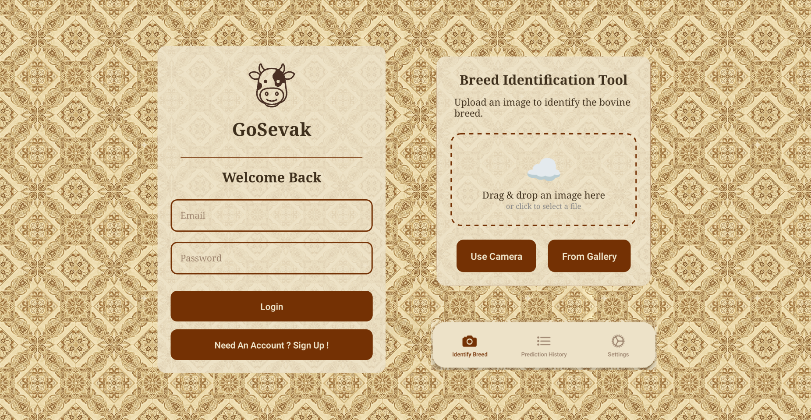

# GoSevak



## An Offline-First AI Assistant for Bovine Breed Identification

### 🚀 Features
- **On-Device AI Model:** Utilizes a PyTorch Lite model locally for instant, offline breed classification.
- **Offline-First Functionality:** All predictions are saved locally first, ensuring the app is fully functional without an internet connection.
- **User Authentication:** Secure user sign-up and login powered by Supabase Auth.
- **Two-Way Cloud Sync:** Data for each authenticated user is securely synced to a Supabase backend.
- **Multi-Device Support:** Synced predictions, including images, are available across all devices for a logged-in user.
- **Cloud Image Storage:** Prediction images are uploaded to Supabase Storage, providing a permanent URL instead of a local path.
- **Robust & Resilient:** Features retry logic for model loading and network requests, with graceful fallbacks for failed uploads.
- **Cross-Platform:** Built with React Native for Android and could be ported to iOS.

### 📖 Table of Contents
1. [Overview](#-overview)
2. [Technology Stack](#-technology-stack)
3. [AI Model & Native Implementation](#-ai-model--native-implementation)
4. [Disclaimer](#️-disclaimer)
5. [Installation](#️-installation)
6. [Contributors](#-contributors)
7. [License](#️-license)

### 🔍 Overview
This project was developed to address a critical challenge faced by Field Level Workers (FLWs) in India: the accurate identification of bovine breeds for the Bharat Pashudhan App. Network instability in rural areas makes cloud-based AI solutions impractical.

**GoSevak** solves this by packaging a trained AI model directly into a React Native application. It allows FLWs to get instant, accurate breed classifications in the field, save their work locally, and sync it to a central database whenever a stable connection is available. This ensures data integrity and improves the effectiveness of national livestock programs.

### 💻 Technology Stack
- **Frontend:** React Native, TypeScript
- **AI Model:** PyTorch Mobile Lite (`.ptl`)
- **Backend & DB:** Supabase (Postgres, Auth, Storage)
- **State Management:** React Context API
- **Navigation:** React Navigation

### 🧠 AI Model & Native Implementation
The core of this application is its ability to run complex deep learning models directly on a mobile device.

The full training process can be reviewed in the **[PTH Model Training Notebook](https://github.com/Priyanshu631/bovine-breeds/blob/main/apps/docs/indian-bovine-breeds-classification.ipynb)**.

**Key Insights:**
- **Model Architecture:** Utilizes a `convnext_tiny` model from the `timm` library, fine-tuned on the dataset using transfer learning.
- **Training:** Employs a two-phase training strategy (warmup and fine-tuning) with techniques like data augmentation, Mixup, and weighted sampling to handle class imbalance across 41 breeds.
- **Performance:** Achieved a validation accuracy of **~65%** on the public dataset.
- **Mobile Conversion:** The final `.pth` model was converted to a full-precision (`fp32`) PyTorch Lite (`.ptl`) format to ensure maximum accuracy for offline, on-device inference.
- **Native Bridge:** A custom Kotlin Native Module (`PytorchModule.kt`) was built from scratch to interface with the React Native frontend. This was necessary as the official `react-native-pytorch-core` library was found to be an unsupported dependency for the project's configuration. The native module files can be requested from the contributors.

### ⚠️ Disclaimer
- The model was trained on a publicly available, non-curated dataset from Kaggle: **[Indian Bovine Breeds Dataset](https://www.kaggle.com/datasets/lukex9442/indian-bovine-breeds)**.
- Due to potential inconsistencies or incorrect labels within this public data, the model's accuracy, while robust, may not reflect the performance achievable with an officially curated and verified dataset.
- Performance can be significantly improved if curated data is provided by the responsible authorities.
- **Hardware Compatibility:** This application is specifically optimized for modern Android phones and targets the **`ARM64-v8a`** architecture to achieve the native performance required for the on-device AI model. This architecture is standard in the overwhelming majority of contemporary smartphones (over 99% of active devices). Please be aware that attempting to run this app on a device or emulator with a different architecture (such as `x86`) will result in a native crash.

### ⚙️ Installation

#### For Direct Use (Recommended for Users)
You can directly install the pre-built application on your Android device.

1.  Navigate to the latest release page: **[GoSevak Releases](https://github.com/Priyanshu631/go-sevak-app/releases)**
2.  Under the **Assets** section, download the `GoSevakApp.apk` file to your Android phone.
3.  You may need to enable "Install from unknown sources" in your phone's settings to install the app.
4.  Open the downloaded file to install GoSevak.

---

#### For Developers (Building from Source)
```bash
# Clone the repository
git clone [https://github.com/Priyanshu631/GoSevakApp.git](https://github.com/Priyanshu631/GoSevakApp.git)

# Navigate to the project directory
cd GoSevakApp

# Install dependencies
yarn install

# Create a .env file in the root and add your Supabase keys
# SUPABASE_URL=YOUR_SUPABASE_URL
# SUPABASE_ANON_KEY=YOUR_SUPABASE_ANON_KEY

# Run the application
yarn android
```

### 📝 Contributors
- **[Priyanshu Ranjan](https://github.com/Priyanshu631)** 
- **[Rajveer Sanyal](https://github.com/rajveer0104)** 
- **[Aniket Nag](https://github.com/homelesssnake-101)** 
- **[Anurima Sarkar](https://github.com/Anurima2206)** 
- **[Rajdeep Podder](https://github.com/raj-deep-20)**
- **[Ritobrata Dutta](https://github.com/drito04)**

### ⚖️ License
- **Check The LICENSE File In The Repo For MIT License.**
